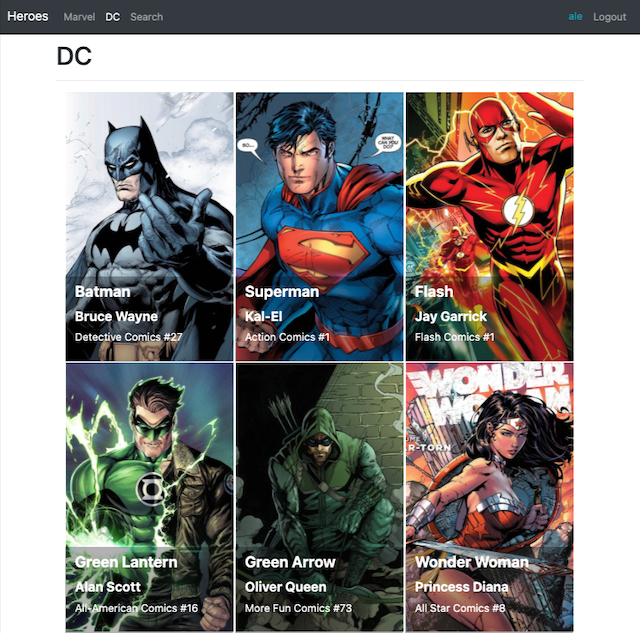

## Hello, I am Alejandro Abad.
After several years as a technician and network administrator and thanks to having successfully passed the Soy Henry bootcamp (800 hours), I was able to crystallize my passion for programming by becoming a fullstack developer. Because willpower and passion for a dream are stronger than time and adversity, I am the proof that when you want, you can.

My objective is to join a remote development team in which to learn and grow, participating in a project in which I can add value, face new challenges and experiences.

 

### What can I contribute? 🎯

As a Full Stack programmer I have management of React, Redux, JavaScript, Typescript, EcmaScript6, HTML5, CSS, Express, Sequelize, PostgreSQL and Node.js technologies, with them I can find agile and successful solutions to all problems or competent requirements. I like to work in a team, I am patient, collaborative and flexible.

 

<!--  -->

### Contact me:
###### Email: abadalejandro@outlook.com
###### Linkedin: www.linkedin.com/in/alejandro-abad-developer
###### Phone: +393923625780

### Projects:

#### Bodegas del Sur 

  -Bodegas del Sur | Final (group) project of the bootcamp "Soy Henry".
Within the framework of Henry's final project and together with a team of seven people, using agile methodologies with one-week sprints, a wine sales SPA (Single Page App) was developed, using React for the Front End and Redux as state management. All the components were developed by applying native CSS rules. We were assigned a Product Owner to whom we showed the progress of the ecommerce app with the design and development of the following features:
Basic e-commerce features (CRUD of products, categories, users, checkout, etc ...)
Payment gateway integration (Mercado Pago).
Cloudinary to upload images to the cloud.
Sending transactional emails.
Implementation of the offer system.

     
   

#### Hero App 

  -In this project I demonstrate my knowledge using the technologies JavaScript, Typescript, React, NodeJS, Bootstrap, CSS and management of private and public routes.

     
   

#### Calendar App 

  -Calendar App is a calendar that you previously entered with user and password, it allows you to add appointments and annotations with the particularity that all connected people can see in real time the modifications made by other connected users.

     
   

#### Bandnames

 -Application that allows us to perform statistics of preferences in real time with an unlimited number of participants.

     
   

#### Todolist

 -Task list made with React, Typescript, Redux, custom hooks, CSS and Bootstrap 5.0.

     
   

                                                                                  
                                                                                  
#### Movieland

 -One of my first applications made with ReactJs, Redux, Fetch and Bootstrap 5.

     
   

                                                                                  

